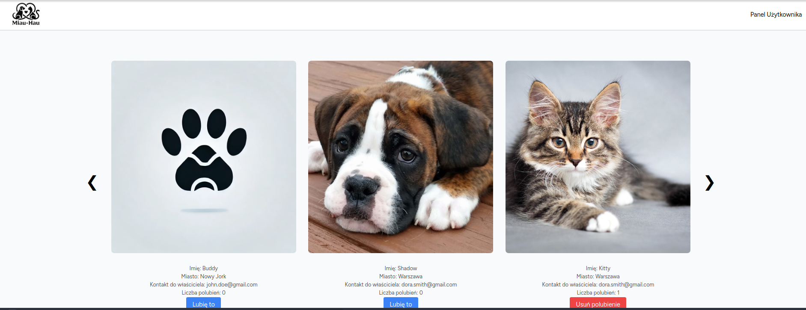
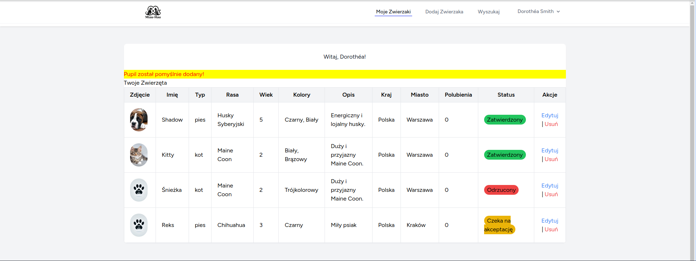
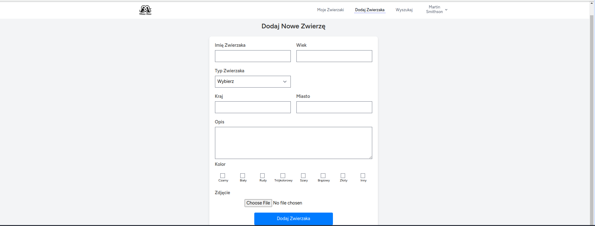
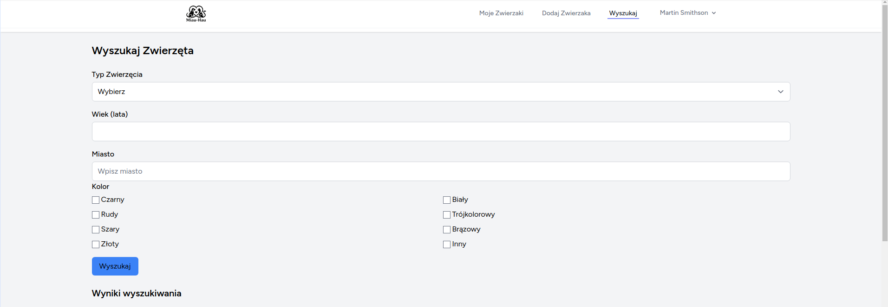
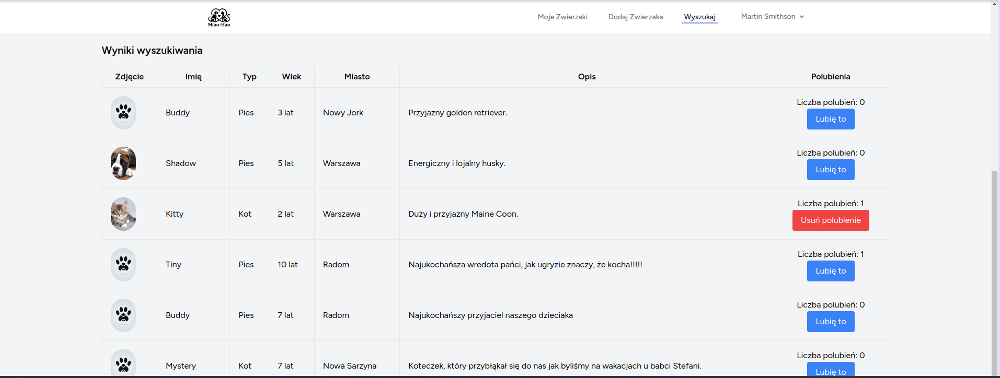
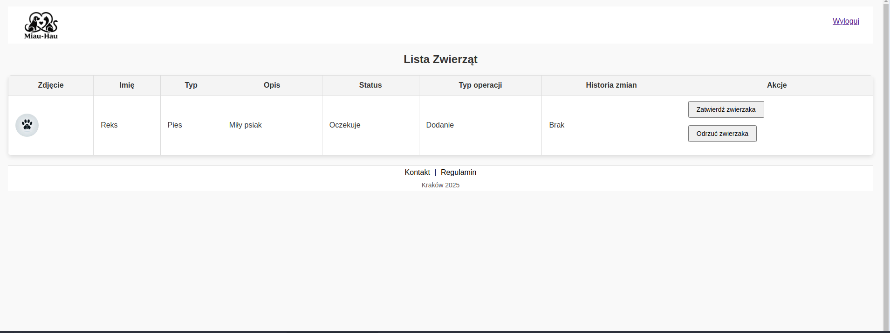

# 🐾 MiauHau – Laravel-based Web Application

MiauHau is a web application built with **Laravel** that allows users to create profiles for their pets, search for other pets based on specific attributes, and like other users' pets. The platform also includes an **admin panel** for approving or rejecting pet profiles.

---

## Key Features

### User Features:
- User profile creation and management
  
- Adding and editing pet profiles
  
- Searching for pets based on characteristics
  
  
- Liking other pets

### Admin Features:
- Approving or rejecting pet profiles
-  

###  Technology Stack:
- **Backend:** Laravel (PHP)
- **Frontend:** Blade, CSS
- **Database:** MySQL
- **Testing:** Unit tests, Acceptance tests

---

